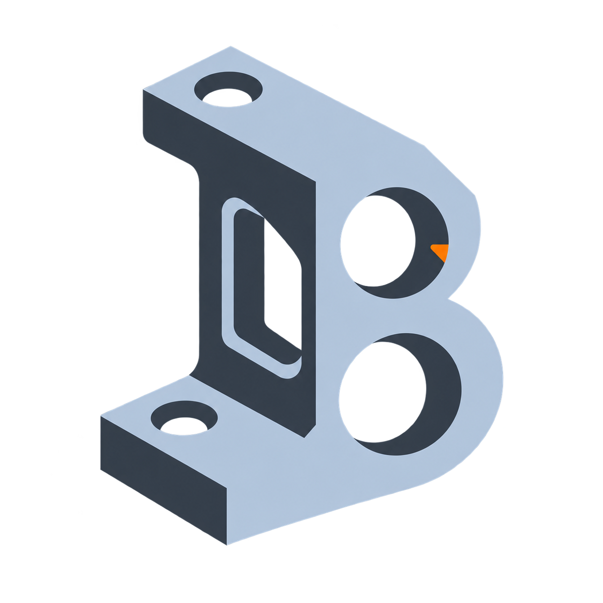

# Burr



Burr is a fast, local CAD model browser with geometry-native STEP assembly
interference checking.

```bash
burr .
```

The browser finds STEP, STL, and GLB files, preserves their folder hierarchy,
and refreshes the active model when a file changes. Models stay on your
machine. Parsing, tessellation, and camera interaction are powered by
[Look](https://github.com/stefangolas/look).

## Viewer

- Browse supported model files from the collapsible sidebar.
- Rotate, pan, zoom, and choose standard camera views.
- Switch the complete interface between light and dark themes.
- Use **X-ray** mode by default to reveal enclosed or occluded occurrences.
- Switch to **Solid** mode for ordinary surface inspection.
- Play or scrub configured motion between matching STEP assembly poses.
- Export the current camera, theme, and render mode as a local PNG snapshot.

Long file names stay on one line and truncate with an ellipsis. The complete
path remains available on hover.

## Assembly interference

For STEP assemblies with at least two component occurrences, Burr checks every
component pair directly from the tessellated world-space geometry. The Checks
tab reports one of three outcomes:

- `pass`: no solid-volume interference was detected;
- `fail`: Burr found crossing surfaces, containment, or coincident occurrences;
- `incomplete`: the file is not a supported assembly or its component meshes
  cannot support a clean result.

Face contact is allowed. Selecting a finding highlights the two involved
components in orange and cyan, while X-ray mode keeps contained components
visible.

This first check deliberately does not claim exact Boolean overlap volume,
clearance, fit, wall thickness, process compliance, or general design
correctness. Those boundaries are tracked in
[docs/roadmap.md](docs/roadmap.md).

## Install

Install the current GitHub release:

```bash
cargo install --git https://github.com/fraylabs/burr.git --tag burr-v0.32.0 --locked
```

Then open any model folder:

```bash
cd your-project
burr .
```

The first installation compiles Burr and its CAD dependencies. Starting an
already-built Burr process is normally near-instant.

## Project configuration

Configuration is optional. Without it, Burr scans the folder passed on the
command line. To limit a project to stable model roots, add
`.burr/config.toml`:

```toml
schema_version = "burr.project.v1"

[project]
models = ["models"]

[[motions]]
id = "fold"
label = "Fold hanger"
from = "models/hanger-deployed.step"
from_label = "Deployed"
to = "models/hanger-folded.step"
to_label = "Folded"
duration_ms = 1200
```

Burr uses the nearest configuration at or above the requested folder. See
[docs/project-configuration.md](docs/project-configuration.md) for validation
and path-safety rules.

The complete public documentation starts at
[docs/index.md](docs/index.md). The Markdown under `docs/` is the canonical
source consumed by burr.sh; keep it hand-authored, public-facing, and linked
with relative paths.

## Local API

The browser shell uses small loopback-only endpoints:

```txt
GET /api/health
GET /api/project
GET /api/tree
GET /api/checks?path=<project-relative-model-path>
GET /viewer?path=<project-relative-model-path>&motion=<motion-id>
```

Check reports use schema `burr.checks.v1` and check id
`assembly-interference`. Model paths remain inside the configured project
scope.

## Development

```bash
cargo test --locked
npm run check:viewer
npm run check
```

`npm run check` is the complete repository gate: formatting, strict production
Clippy, test-target Clippy, Rust tests, and the live viewer/interference proof.

Regenerate the checked-in interference fixtures only when deliberately
changing their geometry:

```bash
uv run scripts/generate-interference-fixtures.py
```

## License

MIT
